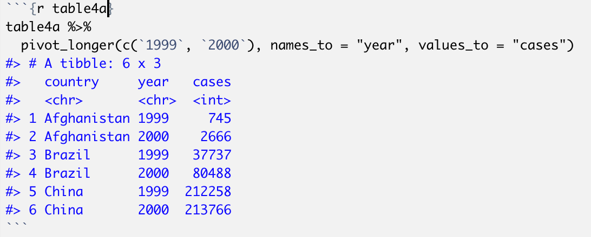
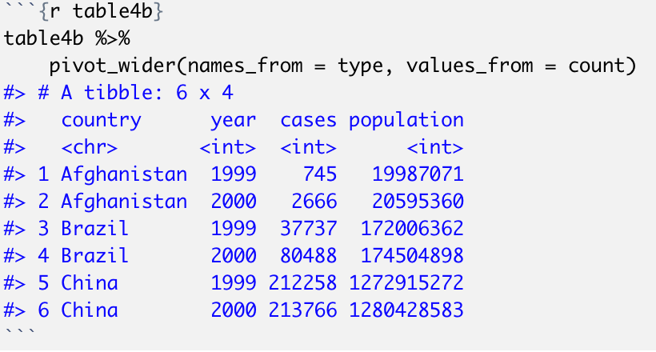
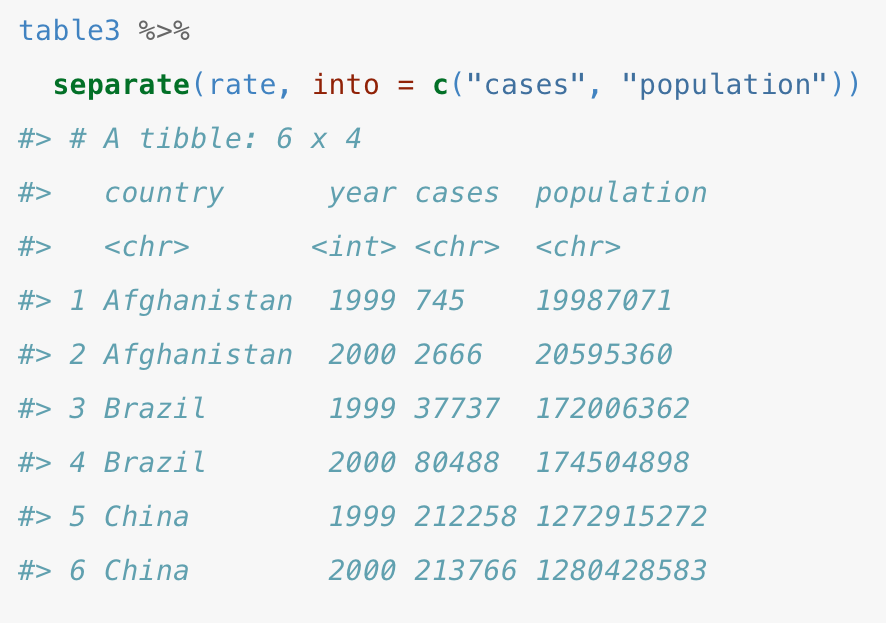
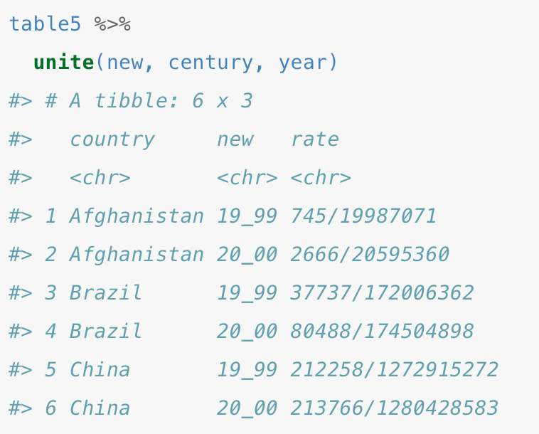
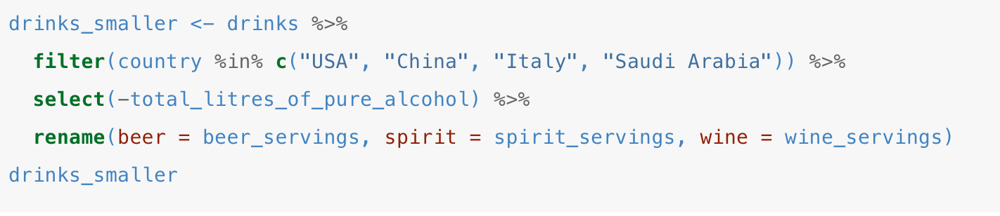
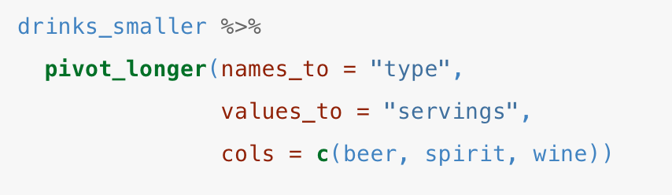
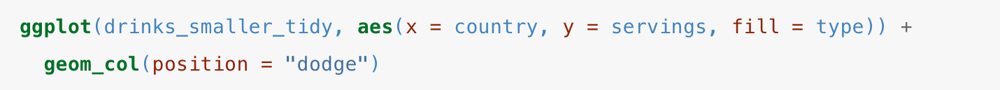
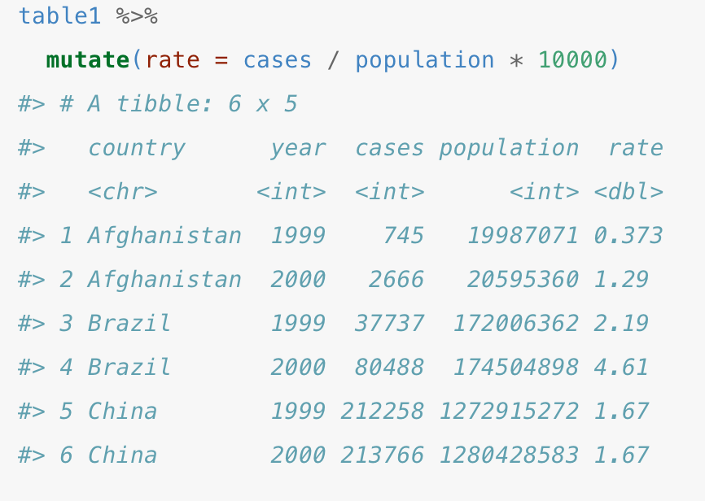
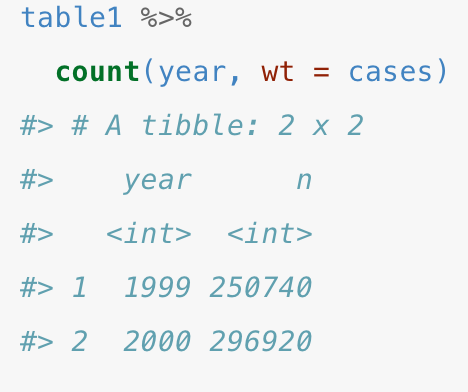
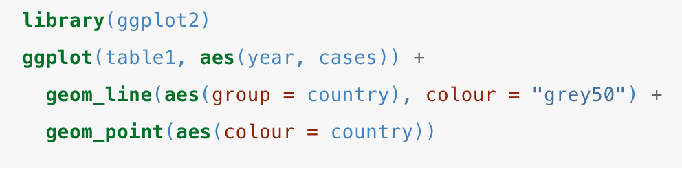

```{r setup, include=FALSE}
library(learnr)
library(tidyverse)
library(readr)
library(fivethirtyeight)

library(ggplot2)
library(plotly)
library(gapminder)


knitr::opts_chunk$set(echo = FALSE)
```


## <span style="color: purple;">Introduction</span>

<span style="color: teal;">**What is the tidyverse package?**</span>

- The tidyverse package provides **tidy tools** and **tidy data**. 


<span style="color: teal;">**What do tidyverse tools do? **</span>

- The package’s tools save us time and effort in data wrangling and altering. 

- Hence, the tools help **tidy up cluttered datasets**.


<span style="color: teal;">**What is tidy data?**</span>

- Tidy data is an organization in R that sorts data

- Requires a particular format 

***

#### <span style="color: purple;">**Tidy Data**</span>

**Recall:** When organizing data sets, we can represent the underlying data in numerous ways depending on where we choose to format each values into rows and columns.

<span style="color: teal;">**Why make your data tidy?**</span>

1. A uniform and organized data structure makes it easier to figure out which tools work best with it.

2. Placing variables in columns allows built-in R functions to work with vectors of the data and transform tidy data. 

<span style="color: teal;">**Tidy Dataset Example:**</span>

```{r table1}
table1
#> # A tibble: 6 x 4
#>   country      year  cases population
#>   <chr>       <int>  <int>      <int>
#> 1 Afghanistan  1999    745   19987071
#> 2 Afghanistan  2000   2666   20595360
#> 3 Brazil       1999  37737  172006362
#> 4 Brazil       2000  80488  174504898
#> 5 China        1999 212258 1272915272
#> 6 China        2000 213766 1280428583
```


<span style="color: teal;">**What makes a Dataset Tidy?**</span>

1.	Each variable must have its own column.

2.	Each observation must have its own row.

3.	Each value must have its own cell.

{ width=90% } 


More information can be found here http://www.jstatsoft.org/v59/i10/paper


******************************************************


## <span style="color: purple;">Getting Started</span>

***

<span style="color: teal;">**Download Tidyverse**</span>

```
library(tidyverse)
```

***

<span style="color: teal;">**How to make a tidy data set:**</span>

**Recall**: Making a dataset **tidy** requires 3 rules: variables are in columns, observations are in rows, and values are in cells.

1. Put each dataset in a **tibble**.

2. Put each **variable** in a column.


<span style="color: blue;">**Code Input:**</span>

````markdown
`r ''````{r}
table1
#> # A tibble: 6 x 4
#>   country      year  cases population
#>   <chr>       <int>  <int>      <int>
#> 1 Afghanistan  1999    745   19987071
#> 2 Afghanistan  2000   2666   20595360
#> 3 Brazil       1999  37737  172006362
#> 4 Brazil       2000  80488  174504898
#> 5 China        1999 212258 1272915272
#> 6 China        2000 213766 1280428583

```
````


******************************************************

## <span style="color: purple;">Tidy Data Exercise</span>

<span style="color: teal;">**Tidy Data Review**</span>

##### **Answer the following three questions using `Table 1`:**

***

**`TABLE 1.`** Stock prices

```{r data, echo=FALSE, warning=FALSE}

stock_table <- read.csv("stock1.csv")


stock_table
```

******

```{r question2, echo=FALSE}
question("**How many variables does Table 1 have?**",
  answer("1"),
  answer("2"),
  answer("3", correct = TRUE),
  answer("4")
)

```

***

```{r question4, echo=FALSE}
question("**Select the unique piece(s) of information Table 1 provides:** (select all that apply)",
  answer("date", correct = TRUE),
  answer("stock investors"),
  answer("location"),
  answer("stock name", correct = TRUE),
  answer("stock price", correct = TRUE)
)

```

***

```{r question, echo=FALSE}
question("**Is Table 1 in `tidy` format?**",
  answer("YES"),
  answer("NO", correct = TRUE),
  answer("Not enough info")
)

```

***

<span style="color: teal;">**Review Solutions**</span>


There are **3 variables** corresponding to **3 unique pieces of information** 

- `date` 

- `stock name`

- `stock price` 

##### **Therefore,** 
Table 1 is **`NOT`** in tidy format because it doesn't have 3 columns


-------------------------------------------------------------------------------
<span style="color: blue;">**`Remember...`**</span>

- <span style="color: magenta;">TIDY DATA FORMAT</span> requires that each variable is its own column


***

<span style="color: teal;">**How Do We Make the Data Tidy?**</span>

##### **Using the `tidyverse` package, we can reorganize the data so there's a column for each variable:**

- `date` 

- `stock name`

- `stock price`


```{r data2, echo=FALSE, warning=FALSE}

tidy_stock_table <- read.csv("stock2.csv")


tidy_stock_table
```

**************************************

## <span style="color: purple;">Pivoting</span>

<span style="color: teal;">**Reorganizing Dataset using Tidyverse Package:**</span>

##### From our previous example using <span style="color: blue;">Table 1</span>, we made the dataset **`tidy`** by decreasing the number of columns and increasing the number of rows.

We can accomplish this using the two **Pivot** Functions:


1. **pivot_longer():** makes datasets longer by increasing the number of rows and decreasing the number of columns

2. **pivot_wider():** makes datasets shorter by decreasing the number of rows and increasing the number of columns


*******************

#### <span style="color: purple;">**Pivot_longer()**</span>

<span style="color: teal;">**Exercise 1.**</span> Consider table 4a. shown below:


**`TABLE 4a.`** Cases of a particular illness per Country 

```{r table 5}
table4a
#> # A tibble: 3 x 3
#>   country     `1999` `2000`
#> * <chr>        <int>  <int>
#> 1 Afghanistan    745   2666
#> 2 Brazil       37737  80488
#> 3 China       212258 213766 

```


```{r question4a, echo=FALSE}
question("**Is Table 4a in `tidy` format?**",
  answer("YES"),
  answer("NO", correct = TRUE),
  answer("Not enough info")
)

```

```{r question10, echo=FALSE}
question("**List the variables shown in the table**",
  answer("Country, Year"),
  answer("Country, Year, Cases", correct = TRUE),
  answer("Country, Cases")
)

```

******

<span style="color: teal;">**Solution 1.**</span> Using pivot_longer() to make data tidy:


<span style="color: green;">Code Input:</span>

{ width=50% } 


<span style="color: green;">Code Output:</span>

```{r table11}
table4a %>% 
  pivot_longer(c(`1999`, `2000`), names_to = "year", values_to = "cases")
#> # A tibble: 6 x 3
#>   country     year   cases
#>   <chr>       <chr>  <int>
#> 1 Afghanistan 1999     745
#> 2 Afghanistan 2000    2666
#> 3 Brazil      1999   37737
#> 4 Brazil      2000   80488
#> 5 China       1999  212258
#> 6 China       2000  213766
```

***************************************

#### <span style="color: purple;">**Pivot_wider()**</span>

<span style="color: teal;">**Exercise 2.**</span> Consider table 4b. shown below:

```{r table44}
table2
#> # A tibble: 12 x 4
#>   country      year type           count
#>   <chr>       <int> <chr>          <int>
#> 1 Afghanistan  1999 cases            745
#> 2 Afghanistan  1999 population  19987071
#> 3 Afghanistan  2000 cases           2666
#> 4 Afghanistan  2000 population  20595360
#> 5 Brazil       1999 cases          37737
#> 6 Brazil       1999 population 172006362
#> # … with 6 more rows
```

```{r question4b, echo=FALSE}
question("**Is Table 4a in `tidy` format?**",
  answer("YES"),
  answer("NO", correct = TRUE),
  answer("Not enough info")
)

```

```{r question100, echo=FALSE}
question("**Which column interrupts tidy format (which column should be taken out)?**",
  answer("Country"),
  answer("Year"),
  answer("Type", correct = TRUE),
  answer("Cases")
)

```

******

<span style="color: teal;">**Solution 2.**</span> Using pivot_wider() to make data tidy:

<span style="color: green;">Code Input:</span>

{ width=50% } 


<span style="color: green;">Code Output:</span>

```{r table444}
table2 %>%
    pivot_wider(names_from = type, values_from = count)
#> # A tibble: 6 x 4
#>   country      year  cases population
#>   <chr>       <int>  <int>      <int>
#> 1 Afghanistan  1999    745   19987071
#> 2 Afghanistan  2000   2666   20595360
#> 3 Brazil       1999  37737  172006362
#> 4 Brazil       2000  80488  174504898
#> 5 China        1999 212258 1272915272
#> 6 China        2000 213766 1280428583
```

***********

#### <span style="color: purple;">**Review:**</span>

```{r question4c, echo=FALSE}
question("**Pivot_longer() makes...**",
  answer("long tables shorter and wider"),
  answer("long tables longer"),
  answer("wide tables longer and narrower", correct = TRUE),
  answer("short tables shorter")
)

```

```{r question4d, echo=FALSE}
question("**Pivot_wider() makes...**",
  answer("long tables shorter and wider", correct= TRUE),
  answer("long tables longer"),
  answer("wide tables longer and narrower"),
  answer("short tables shorter")
)

```


******************************************************

## <span style="color: purple;">Seperating and Uniting</span>

1. **Seperate():** breaks apart one column into multiple columns depending on how many variables are in the column

2. **Unite():**  combines multiple columns into a single column

****

#### <span style="color: teal;">**Separate()**</span>

<span style="color: teal;">**Exercise 1.**</span> Consider table 3. shown below:


**`TABLE 3.`** Cases of a particular illness per Country 

```{r table 55}
table3
#> # A tibble: 6 x 3
#>   country      year rate             
#> * <chr>       <int> <chr>            
#> 1 Afghanistan  1999 745/19987071     
#> 2 Afghanistan  2000 2666/20595360    
#> 3 Brazil       1999 37737/172006362  
#> 4 Brazil       2000 80488/174504898  
#> 5 China        1999 212258/1272915272
#> 6 China        2000 213766/1280428583

```


```{r question44, echo=FALSE}
question("**Which column do we need to seperate?**",
  answer("country column"),
  answer("year column"),
  answer("rate column", correct = TRUE),
  answer("None")
)

```

******


<span style="color: teal;">**Solution 1.**</span> Using seperate() to make data tidy:

**separate()** takes...

1. the name of the column to separate

2. the names of the columns to separate into

<span style="color: green;">Code Input:</span>

{ width=50% } 


<span style="color: green;">Code Output:</span>

```{r table111}
table3 %>% 
  separate(rate, into = c("cases", "population"), convert=TRUE)
#> # A tibble: 6 x 4
#>   country      year cases  population
#>   <chr>       <int> <chr>  <chr>     
#> 1 Afghanistan  1999 745    19987071  
#> 2 Afghanistan  2000 2666   20595360  
#> 3 Brazil       1999 37737  172006362 
#> 4 Brazil       2000 80488  174504898 
#> 5 China        1999 212258 1272915272
#> 6 China        2000 213766 1280428583
```

***************************************

#### <span style="color: purple;">**Unite()**</span>

<span style="color: teal;">**Exercise 2.**</span> Consider table 5. shown below:

```{r table123}
table5
```

```{r question430, echo=FALSE}
question("**Which columns do we need to combine in order to reproduce `Table 3`?**",
  answer("Rate and Country columns"),
  answer("Century and Year columns", correct = TRUE),
  answer("None")
)

```

******

<span style="color: teal;">**Solution 2.**</span> Using unite() to make data tidy:

**unite()** takes...

  1. a data frame
  
  2. the name of the new variable to create
  
  3. a set of columns to combine

<span style="color: green;">Code Input:</span>

{ width=50% } 


<span style="color: green;">Code Output:</span>

```{r table125}
table5 %>% 
  unite(new, century, year)
#> # A tibble: 6 x 3
#>   country     new   rate             
#>   <chr>       <chr> <chr>            
#> 1 Afghanistan 19_99 745/19987071     
#> 2 Afghanistan 20_00 2666/20595360    
#> 3 Brazil      19_99 37737/172006362  
#> 4 Brazil      20_00 80488/174504898  
#> 5 China       19_99 212258/1272915272
#> 6 China       20_00 213766/1280428583
```


******************************************************

## <span style="color: purple;">Data Wrangling Exercise</span>


<span style="color: teal;">**Exercise using More Tidyverse Package:**</span>

***************************************************************************


Here are a few `Data Wrangling` methods we can use on data frames:

1. **Filer()** the dataset to only view 4 countries: USA, China, Italy, Saudi Arabia

2. **Select()** all columns EXCLUDING the total_litres_of_pure_alcohol column (use the **-** sign)

3. **Rename()** the variables from...

    a. beer_servings to `beer`
  
    b. spirit_servings to `spirit`
  
    c. wine_servings to `wine`


************************************************************

<span style="color: teal;">**Exercise 1.**</span> 

Consider table 4 shown below. Use the above data wrangling methods on the following dataset:

**`TABLE 4.`** Drinks per Country 

```{r tabledrinks}
drinks
#> A tibble: 5 x 5
#>   country    beer_servings spirit_servings wine_servings total_litres_of_pure_a…
#>   <chr>              <int>           <int>         <int>                   <dbl>
#> 1 Afghanist…             0               0             0                     0  
#> 2 Albania               89             132            54                     4.9
#> 3 Algeria               25               0            14                     0.7
#> 4 Andorra              245             138           312                    12.4
#> 5 Angola               217              57            45                     5.9
```


```{r exercise1, exercise=TRUE, exercise.eval=TRUE}
# Write code Here

```

****************************

<span style="color: teal;">**Solution 1.**</span> 

Using filer(), select(), and rename() functions:

<span style="color: green;">Code Input:</span>

  { width=50% } 

<span style="color: green;">Code Output:</span>

```{r}
drinks_smaller <- drinks %>% 
  filter(country %in% c("USA", "China", "Italy", "Saudi Arabia")) %>% 
  select(-total_litres_of_pure_alcohol) %>% 
  rename(beer = beer_servings, spirit = spirit_servings, wine = wine_servings)
drinks_smaller
```


***************************************************************************

<span style="color: teal;">**Exercise 2.**</span> 

Consider table 5 shown below. Use the Pivot function to make the following dataset in tidy format: 

**`TABLE 5.`** Drinks Smaller

```{r tabledrinkstidy}
drinks_smaller
#># A tibble: 4 x 4
#>   country       beer spirit  wine
#>   <chr>        <int>  <int> <int>
#> 1 China           79    192     8
#> 2 Italy           85     42   237
#> 3 Saudi Arabia     0      5     0
#> 4 USA            249    158    84
```

```{r exercise2, exercise=TRUE, exercise.eval=TRUE}
# Write code Here

```


*************************************************

<span style="color: teal;">**Solution 2.**</span> 

Using pivot_longer() to make data tidy:

<span style="color: green;">Code Input 1.</span>

  { width=30% } 


<span style="color: green;">Code Output:</span>

```{r}
drinks_smaller_tidy <- drinks_smaller %>% 
  pivot_longer(names_to = "type", 
               values_to = "servings", 
               cols = -country)
drinks_smaller_tidy
```


***************************************************************************

<span style="color: teal;">**Exercise 3.**</span> 

Plot the above solution:

```{r exercise3, exercise=TRUE, exercise.eval=TRUE}
# Write code Here

```

***************************************************************************

<span style="color: teal;">**Solution 3.**</span> 


<span style="color: green;">Code Input:</span>

  { width=50% } 

<span style="color: green;">Code Output:</span>

```{r plot2}
ggplot(drinks_smaller_tidy, aes(x = country, y = servings, fill = type)) +
  geom_col(position = "dodge")
```


***************************************************************************

> More examples and information found at https://moderndive.com/4-tidy.html#tidy-data-ex 

> More information at https://r4ds.had.co.nz/tidy-data.html#missing-values-3

***************************************************************************


## <span style="color: purple;">More Examples</span>


<span style="color: teal;">**More Examples using Tidyverse Packages**</span>

***************

Here are a few examples using tidyverse packages, such as `dplyr` and `ggplot2` on the following dataset:

**`TABLE 1.`** Cases per population

```{r table2}
table1
#> # A tibble: 6 x 4
#>   country      year  cases population
#>   <chr>       <int>  <int>      <int>
#> 1 Afghanistan  1999    745   19987071
#> 2 Afghanistan  2000   2666   20595360
#> 3 Brazil       1999  37737  172006362
#> 4 Brazil       2000  80488  174504898
#> 5 China        1999 212258 1272915272
#> 6 China        2000 213766 1280428583
```

***

<span style="color: teal;">**Exercise 1.**</span> Compute rate per 10,000:

```{r exercise13, exercise=TRUE, exercise.eval=TRUE}
# Write code Here

```


***

<span style="color: teal;">**Solution 1.**</span>


<span style="color: green;">Code Input:</span>

  { width=50% } 
  
<span style="color: green;">Code Output:</span>

```{r table3}
table1 %>% 
  mutate(rate = cases / population * 10000)
#> # A tibble: 6 x 5
#>   country      year  cases population  rate
#>   <chr>       <int>  <int>      <int> <dbl>
#> 1 Afghanistan  1999    745   19987071 0.373
#> 2 Afghanistan  2000   2666   20595360 1.29 
#> 3 Brazil       1999  37737  172006362 2.19 
#> 4 Brazil       2000  80488  174504898 4.61 
#> 5 China        1999 212258 1272915272 1.67 
#> 6 China        2000 213766 1280428583 1.67
```

***

<span style="color: teal;">**Exercise 2.**</span> Compute cases per year:


```{r add-table, exercise=TRUE}
# Add up cases from year 1999
745 + 37737 + 212258
```

```{r add-table2, exercise=TRUE}
# Add up cases from year 2000
2666 + 80488 + 213766
```

```{r exercise12, exercise=TRUE, exercise.eval=TRUE}
# Write code Here

```

***

<span style="color: teal;">**Solution 2.**</span>

<span style="color: green;">Code Input:</span>
  
  { width=28% } 
  
<span style="color: green;">Code Output:</span>

```{r table4}
table1 %>% 
  count(year, wt = cases)
#> # A tibble: 2 x 2
#>    year      n
#>   <int>  <int>
#> 1  1999 250740
#> 2  2000 296920
```

***

<span style="color: teal;">**Exercise 3.**</span> Compute rate per 10,000: Visualize changes over time:

```{r exercise11, exercise=TRUE, exercise.eval=TRUE}
# Write code Here

```

***

<span style="color: teal;">**Solution 3.**</span>

<span style="color: green;">Code Input:</span>
  
  { width=50% } 
  
<span style="color: green;">Code Output:</span>

```{r plot,echo=FALSE}

library(ggplot2)
ggplot(table1, aes(year, cases)) + geom_line(aes(group = country), colour = "grey50") + geom_point(aes(colour = country))

```


******


<span style="color: green;">Cool Interactive Plot:</span>

```{r plot4, echo=FALSE}

p <- gapminder %>%
  filter(year==1977) %>%
  ggplot( aes(gdpPercap, lifeExp, size = pop, color=continent)) +
  geom_point() +
  scale_x_log10() +
  theme_bw()
 
ggplotly(p)
```


  